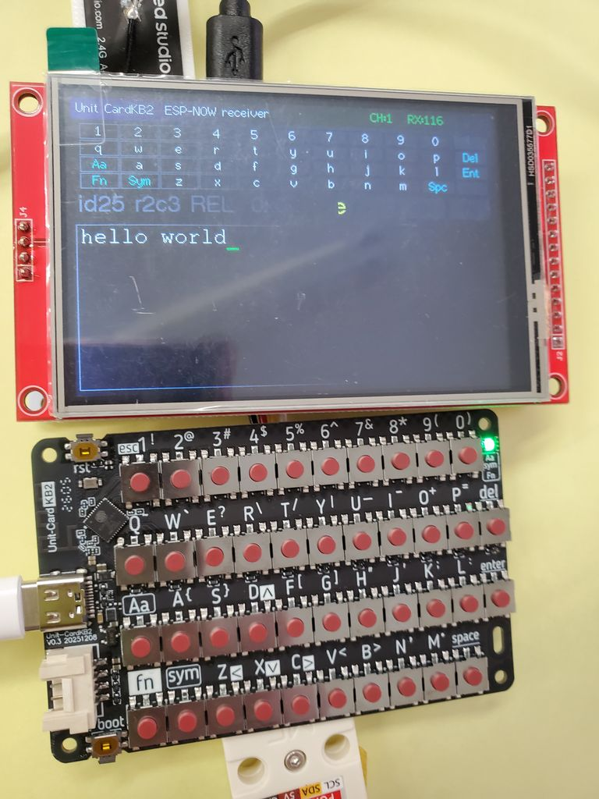

# piyo2_s3_cardkb2

M5Stack **Unit CardKB2** の ESP-NOW ブロードキャストを受信し、押されたキーを
**USB シリアル**と **LCD (480×320)** に表示するレシーバです。

CardKB2 と受信機の間に配線は不要で、CardKB2 は単体（バッテリ or USB 給電）で
動作します。無線キーボードの入力を可視化・デバッグする用途を想定しています。



*上: piyopiyo-pcb v1.6 (XIAO ESP32S3 + ILI9488)、下: Unit CardKB2。*
*CardKB2 で `hello world` と打った内容が、ケーブル接続なしで LCD に表示されている。*
*ヘッダの `CH:1 RX:116` は受信チャンネルと受信パケット数、その下のマトリクスは*
*キー配列（`KEY_ID = 行×11 + 列`）で、CardKB2 の実際のキー配置と一致している。*

---

## 1. ハードウェア

| 項目 | 内容 |
| --- | --- |
| 受信側基板 | **piyopiyo-pcb v1.6** |
| MCU | Seeed Studio XIAO ESP32S3 |
| LCD | ILI9488 320×480 SPI（`setRotation(1)` で 480×320 横向き） |
| タッチ | XPT2046（本プロジェクトでは未使用） |
| ブザー | D0（`tone()` による PWM 駆動 / タッチ音） |
| 送信側 | M5Stack Unit CardKB2 (SKU: U215 / ESP32-C61HF4) |

### v1.6 のピン配置

`include/lgfx_ILI9488_ESP32S3_SPI.h` の `HW_VERSION >= 16` 側が使われます。

| 信号 | ピン |
| --- | --- |
| TFT_MOSI | D10 |
| TFT_SCLK | D8 |
| TFT_CS | D3 |
| TFT_DC | D2 |
| TFT_RST | D1 |
| TFT_MISO | 未使用 (-1) |
| T_CLK / T_DIN / T_DO / T_CS | D8 / D10 / D9 / D7 |

HW バージョンは `platformio.ini` の `-DHW_VERSION=16` で切り替えます（15 = v1.5 以前）。

---

## 2. 使い方

### 2-1. CardKB2 を ESP-NOW モードにする

CardKB2 の電源を入れた状態で **`Fn` + `Sym` + `3`** を押します。
白 LED が **3 回点滅**すれば ESP-NOW ブロードキャストモードです。
この設定は電源を切っても保持されます。

| 組み合わせ | モード | LED |
| --- | --- | --- |
| Fn + Sym + 1 | I2C（工場出荷時） | 白 1 回 |
| Fn + Sym + 2 | UART | 白 2 回 |
| **Fn + Sym + 3** | **ESP-NOW ブロードキャスト** | **白 3 回** |
| Fn + Sym + 4 | BLE HID | 白 4 回 |

### 2-2. ビルドと書き込み

```bash
pio run                    # ビルド
pio run -t upload          # USB で書き込み
pio device monitor -b 115200   # シリアルモニタ
```

書き込み後、起動画面（受信側 MAC 表示）を経てメイン画面に切り替わります。
CardKB2 のキーを押すと LCD とシリアルの両方に反映されます。

---

## 3. LCD 画面

```
┌────────────────────────────────────────────────┐
│ Unit CardKB2 ESP-NOW receiver     CH:1  RX:128 │ ← ヘッダ（CH / 受信パケット数）
├────────────────────────────────────────────────┤
│ 1 2 3 4 5 6 7 8 9 0 ・                         │
│ q w e r t y u i o p Del                        │ ← キーマトリクス（11列×4行）
│ Aa a s d f g h j k l Ent                       │    KEY_ID = 行×11 + 列 と同じ配置
│ Fn Sym z x c v b n m Spc ・                    │
│                                                │
│ id23 r2c1  PRESS 'a'      [CAPS][SYM][FN]      │ ← 最後のキー情報 + 修飾キー状態
│ ┌────────────────────────────────────────────┐ │
│ │ hello world_                               │ │ ← 入力テキスト（33文字×7行）
│ │                                            │ │
│ └────────────────────────────────────────────┘ │
└────────────────────────────────────────────────┘
```

| エリア | 動作 |
| --- | --- |
| ヘッダ | 現在の WiFi チャンネルと受信パケット数を表示 |
| キーマトリクス | 押下中のキーをオレンジで点灯。Aa / Sym の状態に応じてラベルが大文字面・記号面に貼り替わる |
| 情報行 | `id / 行列 / PRESS・REL / 文字` を表示。右の CAPS・SYM・FN チップは点灯で有効、CAPS はロック時のみ赤枠 |
| テキストエリア | 等幅フォント（FreeMono12pt7b）で 33 桁 × 7 行。行末で自動折り返し、Enter で改行、最下行を超えると 1 行スクロール、Delete で 1 文字削除。カーソル位置に緑のアンダーライン |

描画は 1 文字ずつの上書きが基本で、全面クリアはスクロール時のみ。
キーリピート（50ms 間隔）でもちらつきません。

### タッチ音

キー押下時にブザー（D0）が鳴ります。文字キーと特殊キーで音程を変えているので、
画面を見ていなくても Enter / Delete / Space などを押したことが分かります。
起動完了時にも 2 音鳴ります。

`tone()` はキューに積むだけで別タスクが鳴らすため、受信処理をブロックしません。
**ON/OFF は `platformio.ini` の `-DBEEP_ENABLE=1` / `=0` で切り替えます**（デフォルト ON）。
音程・長さは [6章の設定](#6-設定srcmaincpp-冒頭のマクロ)を参照してください。

---

## 4. シリアル出力

115200bps。1 パケットにつき 1 行、生バイト列と解析結果を出力します。

```
[4C:75:25:AA:BB:CC] RAW: AA 03 17 01 1B  id=23 (r2,c1 ) PRESS    'a' (0x61)  [ ]
[4C:75:25:AA:BB:CC] RAW: AA 03 17 02 1C  id=23 (r2,c1 ) RELEASE  [ ]
TEXT> a
```

ヘッダ／長さ／チェックサム／KEY_ID 範囲を検証し、不正な場合は理由付きで
`-> ERR: checksum recv=.. calc=..` のように出力します。

---

## 5. ESP-NOW プロトコル

CardKB2 の ESP-NOW フレームは **UART モードと同一**の 5 バイト固定長です。

```
AA [DATA_LEN] [KEY_ID] [KEY_STATE] [CHECKSUM]
```

| バイト | フィールド | 値 |
| --- | --- | --- |
| 0 | フレームヘッダ | `0xAA` 固定 |
| 1 | DATA_LEN | `0x03` 固定 |
| 2 | KEY_ID | キーインデックス 0–43（= 行番号 × 11 + 列番号、行 0–3 / 列 0–10） |
| 3 | KEY_STATE | `0x01` = 押下 / `0x02` = 解放 |
| 4 | CHECKSUM | `(DATA_LEN + KEY_ID + KEY_STATE) & 0xFF` |

**例**（`1` キー = index 0）
- 押下: `AA 03 00 01 04`
- 解放: `AA 03 00 02 05`

### 通信パラメータ

| 項目 | 値 |
| --- | --- |
| プロトコル | ESP-NOW（2.4GHz WiFi） |
| WiFi モード | Station (STA) |
| 宛先 | `FF:FF:FF:FF:FF:FF`（ブロードキャスト） |
| チャンネル | 0（= 現在のチャンネル。実際は既定の 1） |

### 重要な注意点

**ESP-NOW では「文字」は送られてきません。** 送られるのはキー番号だけです。
Aa（大文字）や Sym（記号）の状態は CardKB2 の内部にあり、送信されないため、
**受信側で修飾キーの状態を持ってキーコード表を引く必要があります**。
本プロジェクトはこれを `main.cpp` の `KEYMAP[44]` と `handleKey()` で実装しています。

- **Aa**：シングルクリック = 次の 1 文字だけ大文字 / ダブルクリック = Caps Lock /
  長押し中は大文字（長押し判定 300ms、ダブルクリック判定 400ms）
- **Sym**：クリックでトグル。Sym 有効中は Aa は無効（マニュアル Table 5 の注記に準拠）
- **Fn**：押下状態のみ保持（Fn + D/X/Z/C の矢印キーは BLE HID モード専用のため、
  ESP-NOW ではキー番号がそのまま飛んできます）
- キーを 300ms 以上押し続けると 50ms 間隔（約 20 回/秒）でリピート送信されます

### キーコード表

`KEYMAP[]` はユーザーマニュアルの Table 3（通常）/ Table 4（Caps）/ Table 5（記号）に対応します。

| index | 行 | キー（通常 / Caps / Sym） |
| --- | --- | --- |
| 0–9 | 0 | `1234567890` / 同左 / `!@#$%^&*()` |
| 10 | 0 | （未使用） |
| 11–20 | 1 | `qwertyuiop` / `QWERTYUIOP` / `~\`?\/\|_-+=` |
| 21 | 1 | Delete (`0x08`) |
| 22 | 2 | Aa（Caps キー） |
| 23–31 | 2 | `asdfghjkl` / `ASDFGHJKL` / `{}^[]"';:` |
| 32 | 2 | Enter (`0x0A`) |
| 33 | 3 | Fn |
| 34 | 3 | Sym |
| 35–41 | 3 | `zxcvbnm` / `ZXCVBNM` / `ZXC<>,.` |
| 42 | 3 | Space (`0x20`) |
| 43 | 3 | （未使用） |

---

## 6. 設定（`src/main.cpp` 冒頭のマクロ）

| マクロ | 既定値 | 説明 |
| --- | --- | --- |
| `ESPNOW_CHANNEL` | `1` | 受信を待つ WiFi チャンネル |
| `CHANNEL_HUNT` | `0` | 0 = `ESPNOW_CHANNEL` に固定（既定）。1 = 最初の 1 パケットを受信するまで CH1→13 を自動巡回する（チャンネル違いの切り分け用） |
| `CHANNEL_HUNT_MS` | `3000` | 受信が無いとき次のチャンネルへ移るまでの時間 (ms)。`CHANNEL_HUNT=1` のときのみ有効 |
| `ECHO_TEXT` | `1` | 1 = 変換後の文字をシリアルの `TEXT>` 行にも連結表示する |
| `ALLOWED_MAC[6]` | 全て `0x00` | 送信元 MAC フィルタ。全て 0 なら制限なし。CardKB2 の MAC を書くと他の送信元を無視する（→ [8章](#8-セキュリティ上の注意)） |
| `BEEP_PIN` | `D0` | ブザーの出力ピン |
| `BEEP_MS` | `12` | 鳴動時間 (ms)。キーリピート間隔 50ms より短くする |
| `BEEP_FREQ` | `2600` | 文字キーの音程 (Hz) |
| `BEEP_FREQ_SP` | `1500` | 特殊キー（Del / Ent / Space / Aa / Sym / Fn）の音程 (Hz) |

### `platformio.ini` の `build_flags`

| フラグ | 既定値 | 説明 |
| --- | --- | --- |
| `HW_VERSION` | `16` | 基板リビジョン。16 = v1.6 以降 / 15 = v1.5 以前（LCD の CS ピンが異なる） |
| `ARDUINO_USB_CDC_ON_BOOT` | `1` | `Serial` を USB CDC にする |
| `BEEP_ENABLE` | `1` | **タッチ音の ON/OFF。1 = 鳴らす（デフォルト） / 0 = 消音** |

```ini
build_flags =
    -DHW_VERSION=16
    -DARDUINO_USB_CDC_ON_BOOT=1
    -DBEEP_ENABLE=1          ; タッチ音 1=ON(デフォルト) / 0=OFF
```

消音にするには `-DBEEP_ENABLE=0` に変えて再ビルドします（ブザー関連のコードごと
除外されるので、Flash が約 6.6KB 減ります）。

---

## 7. ファイル構成

```
piyo2_s3_cardkb2/
├── README.md
├── LICENSE                               ; MIT
├── platformio.ini                        ; HW_VERSION=16 / LovyanGFX / USB CDC 有効
├── docs/
│   └── cardkb2_espnow_demo.jpg           ; 動作確認時の写真
├── include/
│   └── lgfx_ILI9488_ESP32S3_SPI.h        ; LGFX 定義（piyopiyo-pcb v1.5/v1.6 のピン切替）
└── src/
    └── main.cpp                          ; ESP-NOW 受信・キー解析・シリアル/LCD 表示
```

### `main.cpp` の構造

| ブロック | 役割 |
| --- | --- |
| `KEYMAP[44]` | KEY_ID → 通常 / Caps / Sym の ASCII と表示ラベル |
| `pushEvent()` / `onDataRecv()` | ESP-NOW 受信コールバック。リングバッファに積むだけで描画はしない（IDF 4/5 両対応の署名ガード付き） |
| `lcdDrawHeader/Grid/Cell/Modifiers/LastKey` | LCD 各パーツの描画 |
| `txtPutChar()` / `txtNewLine()` / `lcdRedrawText()` | テキストエリアのバッファ管理と描画 |
| `handleKey()` | 修飾キーの状態遷移と文字変換 |
| `macAllowed()` / `processPacket()` | 送信元 MAC フィルタとフレーム検証（ヘッダ / 長さ / チェックサム / 範囲） |
| `loop()` | キュー消化 + チャンネル巡回 |

---

## 8. セキュリティ上の注意

**CardKB2 の ESP-NOW ブロードキャストは、暗号化も認証もされていません。**
キーボードの入力を扱う以上、以下は理解した上で使ってください。

### 打鍵内容は平文で周囲に飛ぶ

CardKB2 は宛先 `FF:FF:FF:FF:FF:FF` のブロードキャストでキーコードを送ります。
ペアリングも暗号化も無いため、**電波の届く範囲にいる誰でも同じフレームを受信でき、
本プロジェクトと同じキーコード表を使えば打鍵内容を復元できます。**

- パスワード、認証コード、個人情報など、**秘密にすべき入力を ESP-NOW モードで打たない**
- それらを入力する必要がある場合は I2C / UART モード（有線）を使う

### 偽のキー入力を注入されうる

受信側も送信元を検証できません。第三者が同じ 5 バイトフレームを投げれば、
この受信機は正規の打鍵として受け付けます。用途に応じて対策してください。

`src/main.cpp` の `ALLOWED_MAC` に CardKB2 の MAC を設定すると、
その送信元以外のパケットを破棄します。

```c
// 例: 送信元を 4C:75:25:12:34:56 に限定する
static const uint8_t ALLOWED_MAC[6] = {0x4C, 0x75, 0x25, 0x12, 0x34, 0x56};
```

MAC はシリアル出力の行頭 `[4C:75:25:...]` に表示されるので、そこから確認できます。
弾かれたパケットは `-> IGNORED: sender MAC` として記録されます。

ただし MAC は詐称可能なので、これは事故や混信を防ぐ程度の対策です。
ESP-NOW の暗号化ピア（LMK）は CardKB2 の工場ファームがブロードキャスト固定のため使えません。
**受信したキー入力を、認証や機器制御など重要な判断に直結させないでください。**

### リポジトリ公開時

- 本プロジェクトは WiFi 接続を行わないため、SSID / パスワードをコードに持ちません
- `.gitignore` で `.pio/`（ビルド済みファームウェアを含む）、`.vscode/c_cpp_properties.json`、
  `.claude/settings.local.json`、`secrets.h` / `wifi_config.h` / `data/wifi.json` 等を除外しています
- README 中の MAC アドレス（`4C:75:25:AA:BB:CC`）は説明用の例です

---

## 9. トラブルシューティング

| 症状 | 対処 |
| --- | --- |
| 何も受信しない | まず CardKB2 が ESP-NOW モードか確認（Fn + Sym + 3 → 白 LED 3 回点滅）。それでも駄目ならチャンネル違いを疑い、`CHANNEL_HUNT` を `1` にして再ビルドする。CH1→13 を自動で巡回するので、ヘッダの `CH:` 表示を見て止まったチャンネルを `ESPNOW_CHANNEL` に設定し、`CHANNEL_HUNT` を `0` に戻す |
| 大文字/記号がずれる | 受信機は Aa / Sym の状態を独自に追従しているため、受信機の再起動や取りこぼしで CardKB2 側とずれることがある。Aa / Sym を押し直すと同期する |
| LCD が真っ白／表示されない | `platformio.ini` の `-DHW_VERSION` が基板のリビジョンと一致しているか確認（v1.5 は 15、v1.6 は 16。TFT_CS が D6↔D3 で異なる） |
| シリアルに何も出ない | `-DARDUINO_USB_CDC_ON_BOOT=1` のため USB CDC。起動直後の 2 秒間の出力は取りこぼすことがある |

---

## 10. 動作確認状況

- ビルド: OK（RAM 13.7% / Flash 31.0%）
- **実機動作確認: 済（2026-07-27, piyopiyo-pcb v1.6 + Unit-CardKB2 v0.3）**
  ESP-NOW 受信・キー解析・LCD 表示・シリアル出力が動作することを確認（[写真](docs/cardkb2_espnow_demo.jpg)）。
  - 受信チャンネルは **CH:1** で確立。CardKB2 のマニュアルにある「チャンネル 0」は
    「現在のチャンネル」の意味で、実測でも既定の 1 だった。
  - キーマトリクス表示の配置（行 0 と行 3 の 11 列目が空き）が実機のキー配置と一致することを確認。

### 調整の余地があるパラメータ

実運用で気になった場合は以下を調整してください。

| 対象 | 場所 | 備考 |
| --- | --- | --- |
| 受信チャンネル | `ESPNOW_CHANNEL` | 実測の CH:1 に固定済み（`CHANNEL_HUNT=0`）。環境が変わって受信できなくなったら `CHANNEL_HUNT=1` で再探索する |
| Aa の長押し判定 | `handleKey()` の `held < 300` | 300ms。押しっぱなしと単発クリックの境目 |
| Aa のダブルクリック判定 | `handleKey()` の `now - g_aaClickMs < 400` | 400ms。Caps Lock に入る間隔 |
| テキストエリアの桁数・行数 | `TXT_COLS` / `TXT_ROWS` / `CH_W` / `CH_H` | フォントを変えた場合は `CH_W` / `CH_H` も合わせて変更する |

---

## 11. 参考資料

- [Unit CardKB2 - m5-docs](https://docs.m5stack.com/en/unit/Unit_CardKB2)
- [Unit CardKB2 Arduino Tutorial](https://docs.m5stack.com/en/arduino/projects/unit/unit_cardkb2)
- [Unit CardKB2 User Manual & Registers (PDF)](https://m5stack-doc.oss-cn-shenzhen.aliyuncs.com/1225/Unit_CardKB2_User_Manual_EN.pdf)
- [M5Unit-CardKB2-UserDemo（工場出荷ファームウェア）](https://github.com/m5stack/M5Unit-CardKB2-UserDemo)
- [LovyanGFX](https://github.com/lovyan03/LovyanGFX)
- LCD 定義の元ネタ: `../piyopiyo-pcb_sample_480x320/`
  （さらに元は [LovyanGFX の 2_user_setting.ino](https://github.com/lovyan03/LovyanGFX/blob/master/examples/HowToUse/2_user_setting/2_user_setting.ino)）

---

## 12. ライセンス

[MIT License](LICENSE)

依存ライブラリは各自のライセンスに従います（LovyanGFX: FreeBSD License）。
